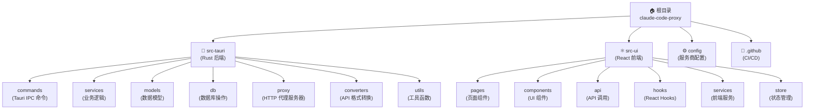

# ClaudeCodeProxy - AI 上下文文档

> **项目愿景**: 为 Claude Code 提供简洁高效的本地代理管理工具，实现智能路由、自动故障切换和负载均衡。UI 设计以黑金样式为主，跨平台支持 Windows、macOS、Linux。

---

## 变更记录 (Changelog)

### 2025-12-10 - AI 上下文初始化
- 生成项目级和模块级 CLAUDE.md 文档
- 建立完整的模块索引和导航结构
- 创建 Mermaid 架构图和面包屑导航
- 扫描覆盖率：~85%（核心模块已覆盖）

### 历史记录
- 001-claude-code-proxy: Added 本地文件系统
- 002-smart-switch-optimization: 添加智能切换优化
- 每次提交 git 前都要删除无用 md 文件以及测试代码，并且优化 README 文档。并且判断是否有必要更新版本号触发 actions，如果是小的更新以及修复就不用更新版本号

---

## 项目概览

**ClaudeCodeProxy** 是一个跨平台桌面应用（Windows、macOS、Linux），专为 Claude Code 设计，提供本地代理管理、智能路由、API 配置管理、健康检查等功能。

### 技术栈

| 层级 | 技术 |
|------|------|
| 后端 | Rust 1.70+ (Edition 2021), Tauri 2.0, Tokio, Hyper, SQLite (Rusqlite) |
| 前端 | React 18, TypeScript 5.3+, Tailwind CSS, Vite |
| 安全 | 系统密钥链 (Keyring), Rustls |
| 构建 | Cargo, npm, GitHub Actions |

### 当前版本

**v1.2.0** (生产就绪)

---

## 架构总览

### 模块结构图（Mermaid）



---

## 模块索引

### 核心模块

| 模块 | 路径 | 语言 | 职责 | 文档 |
|------|------|------|------|------|
| **Rust 后端** | `src-tauri/` | Rust | Tauri 后端、代理服务器、数据库、业务逻辑 | [CLAUDE.md](./src-tauri/CLAUDE.md) |
| **React 前端** | `src-ui/` | TypeScript/React | UI 界面、路由、组件、API 调用 | [CLAUDE.md](./src-ui/CLAUDE.md) |
| **服务商配置** | `config/` | JSON | 服务商预设、推荐服务配置 | [README.md](./config/README.md) |
| **CI/CD** | `.github/` | YAML | GitHub Actions 多平台构建 | [build.yml](./.github/workflows/build.yml) |

### 子模块详情

#### src-tauri 子模块

| 子模块 | 职责 | 关键文件 |
|--------|------|----------|
| `commands/` | Tauri IPC 命令处理 | `mod.rs`, `proxy_service.rs`, `api_config.rs` |
| `services/` | 业务逻辑服务 | `proxy_service.rs`, `balance_service.rs`, `health_check_service.rs` |
| `models/` | 数据模型定义 | `api_config.rs`, `config_group.rs`, `health_check.rs` |
| `db/` | 数据库初始化、迁移 | `init.rs`, `migrations.rs`, `pool.rs` |
| `proxy/` | HTTP 代理服务器 | `server.rs`, `router.rs`, `error_handler.rs` |
| `converters/` | API 格式转换 | `claude_to_gemini.rs`, `gemini_to_claude.rs` |
| `utils/` | 工具函数 | `logger.rs`, `paths.rs`, `constants.rs` |

#### src-ui 子模块

| 子模块 | 职责 | 关键文件 |
|--------|------|----------|
| `pages/` | 页面路由组件 | `Dashboard.tsx`, `ConfigManagement.tsx`, `Settings.tsx` |
| `components/` | 可复用 UI 组件 | `ServiceCard.tsx`, `ProxyStatusCard.tsx`, `HealthMonitorPanel.tsx` |
| `api/` | API 调用封装 | `proxy.ts`, `config.ts`, `balance.ts` |
| `hooks/` | 自定义 React Hooks | `useProxyStatus.ts`, `useAutoSwitch.ts`, `useTestResults.ts` |
| `services/` | 前端服务 | `i18n.ts`, `toast.ts` |
| `store/` | 全局状态管理 | `autoRefreshStore.ts` |

---

## 运行与开发

### 开发环境启动

```bash
# 安装依赖
cd src-ui && npm install && cd ..

# 启动开发服务器
./start-dev.sh
```

### 构建生产版本

```bash
# 构建所有平台安装包（需在对应平台上运行）
./build.sh

# 或仅构建当前平台可执行文件
./build.sh --current
```

### 数据库位置

- **开发环境**: `~/.claude-code-proxy/claude-code-proxy.db`
- **生产环境**: 用户数据目录（由 Tauri 管理）

### 代理服务端口

- **默认端口**: `25341`
- **配置位置**: `src-tauri/src/utils/constants.rs`

---

## 测试策略

### 后端测试

```bash
cd src-tauri
cargo test
```

### 前端测试

```bash
cd src-ui
npm test
npm run test:coverage
```

### 集成测试

- 使用 Tauri 内置测试框架
- 测试文件位置：`src-tauri/tests/`（如存在）

---

## 编码规范

### Rust 代码规范

- 使用 `rustfmt` 格式化：`cargo fmt`
- 使用 `clippy` 检查：`cargo clippy`
- 遵循 Rust Edition 2021 标准
- 配置文件：`src-tauri/rustfmt.toml`, `src-tauri/.clippy.toml`

### TypeScript/React 规范

- 使用 ESLint：`npm run lint`
- 使用 Prettier 格式化：`npm run format`
- 遵循 React Hooks 最佳实践
- 配置文件：`src-ui/.eslintrc.cjs`, `src-ui/prettier.config.js`（如存在）

### 命名约定

- **Rust 模块**: `snake_case`
- **TypeScript 文件**: `PascalCase` (组件), `camelCase` (工具)
- **数据库表**: `snake_case`
- **环境变量**: `UPPER_SNAKE_CASE`

---

## AI 使用指引

### 为 AI 优化的入口点

1. **后端入口**: `src-tauri/src/main.rs` - 了解应用初始化流程
2. **前端入口**: `src-ui/src/App.tsx` - 了解路由和页面结构
3. **代理服务**: `src-tauri/src/proxy/server.rs` - HTTP 代理核心逻辑
4. **数据库模型**: `src-tauri/src/models/mod.rs` - 数据结构定义

### 常见任务索引

| 任务 | 相关模块 | 关键文件 |
|------|----------|----------|
| 添加新 API 配置 | `src-tauri/services`, `src-ui/api` | `api_config.rs`, `config.ts` |
| 修改代理逻辑 | `src-tauri/proxy` | `router.rs`, `server.rs` |
| 添加新页面 | `src-ui/pages`, `src-ui/components` | `App.tsx`, `Sidebar.tsx` |
| 修改数据库模式 | `src-tauri/db` | `migrations.rs`, `init.rs` |
| 更新服务商配置 | `config/` | `providers.json` |

### 模块依赖关系

```
commands/ → services/ → models/ + db/
proxy/ → services/ (通过状态管理)
converters/ ← proxy/ (API 格式转换)
src-ui/api/ → commands/ (通过 Tauri IPC)
```

---

## 常见问题 (FAQ)

### 如何添加新的服务商配置？

编辑 `config/providers.json`，参考 [配置文档](./config/README.md)。

### 如何修改代理端口？

修改 `src-tauri/src/utils/constants.rs` 中的 `DEFAULT_PROXY_PORT`。

### 数据库迁移如何执行？

自动执行，见 `src-tauri/src/db/migrations.rs`。

### 如何调试前端与后端通信？

使用 Tauri DevTools（开发模式自动启用）。

---

## 相关资源

- **GitHub 仓库**: https://github.com/sunjackson/claude-code-proxy
- **问题反馈**: https://github.com/sunjackson/claude-code-proxy/issues
- **发布页面**: https://github.com/sunjackson/claude-code-proxy/releases
- **Claude Code 官方**: https://www.anthropic.com/claude-code

---

**最后更新**: 2025-12-11 (代码质量优化)
**维护者**: sunjackson
**版本**: 1.2.0
