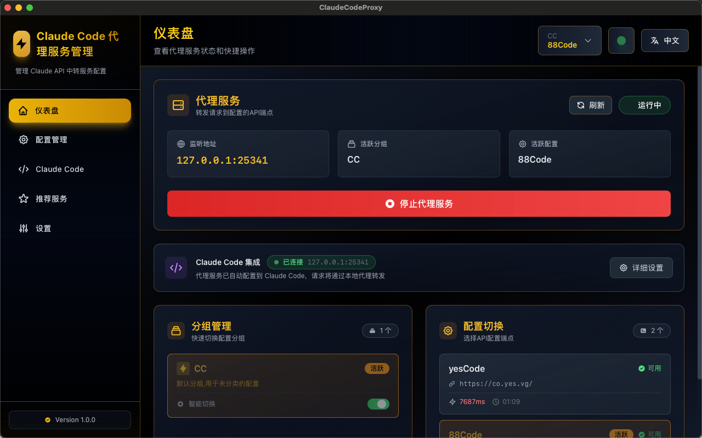
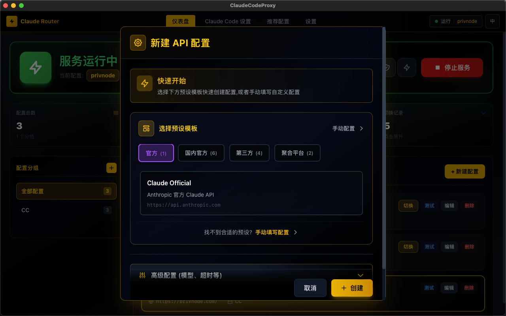
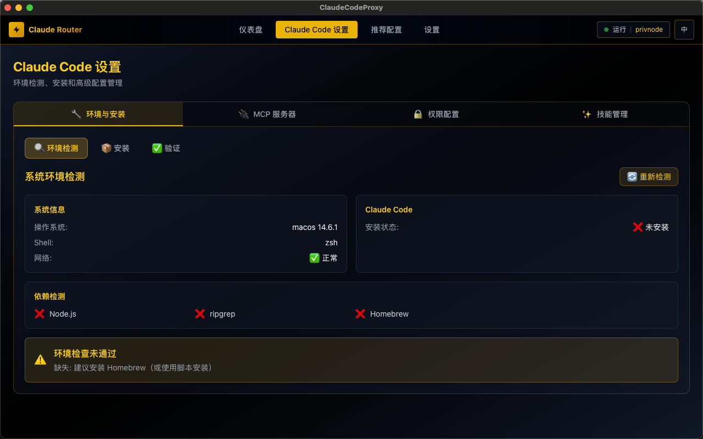

# ClaudeCodeProxy

<div align="center">


**跨平台桌面应用 - 管理 Claude Code 的本地代理服务**

[](https://github.com/sunjackson/claude-code-proxy/actions/workflows/build.yml)
[](https://www.rust-lang.org/)
[](https://tauri.app/)
[](https://reactjs.org/)
[](./LICENSE)

[English](./README_EN.md) | 简体中文

</div>

---

## 简介

ClaudeCodeProxy 是专为 Claude Code 设计的本地代理管理工具，帮助您轻松管理多个 API 中转服务，实现智能路由、自动故障切换和负载均衡。通过简洁优雅的黑金主题界面，一键配置、测试和切换不同的 API 服务。

### 核心优势

- **专为 Claude Code 优化** - 自动检测并配置，无需手动修改配置文件
- **智能路由** - 多配置分组管理，自动负载均衡和故障切换
- **安全可靠** - API 密钥加密存储在系统密钥链中
- **美观易用** - 黑金主题 UI，操作简单直观
- **跨平台** - 支持 Windows、macOS 和 Linux

---

## 功能特性

| 功能 | 描述 |
|------|------|
| **Zero-Config 启动向导** | 自动检测环境、安装 Claude Code CLI、配置代理服务 |
| **一键配置 Claude Code** | 自动检测配置文件，一键启用/禁用代理 |
| **分组管理** | 创建多个配置分组，独立管理 API 配置 |
| **智能切换** | 配置内负载均衡，故障自动切换 |
| **连接测试** | 实时测试 API 连接性和延迟 |
| **余额查询** | 自动查询 API 余额，余额不足提醒 |
| **健康检查** | 定时检测 API 连通性，实时监控状态 |
| **高级配置** | MCP 服务器、权限配置、Skills 技能管理 |

---

## 界面预览

<table>
<tr>
<td width="50%"><br/><em>仪表盘 - 代理状态与配置管理</em></td>
<td width="50%"><br/><em>配置管理 - API 配置与测试</em></td>
</tr>
<tr>
<td width="50%"><br/><em>环境设置向导 - 自动检测安装</em></td>
<td width="50%"><br/><em>高级配置 - MCP/权限/Skills</em></td>
</tr>
</table>

---

## 快速开始

### 系统要求

| 平台 | 最低版本 | 推荐版本 |
|------|---------|---------|
| Windows | 10 | 11 |
| macOS | 11 Big Sur | 14 Sonoma |
| Linux | Ubuntu 20.04 | Ubuntu 22.04+ |

### 下载安装

访问 [Releases](https://github.com/sunjackson/claude-code-proxy/releases) 下载对应平台安装包：

| 平台 | 安装包 |
|------|--------|
| **Windows** | `ClaudeCodeProxy_x.x.x_x64.msi` |
| **macOS (Apple Silicon)** | `ClaudeCodeProxy_x.x.x_aarch64.dmg` |
| **macOS (Intel)** | `ClaudeCodeProxy_x.x.x_x86_64.dmg` |
| **Linux** | `ClaudeCodeProxy_x.x.x_amd64.deb` 或 `.AppImage` |

### macOS 安装说明

```bash
# 方法一：移除隔离属性（推荐）
xattr -d com.apple.quarantine /Applications/ClaudeCodeProxy.app

# 方法二：右键点击应用 → 选择"打开"
```

### 首次使用

1. 启动应用，完成环境设置向导
2. 进入「配置管理」添加 API 配置
3. 在「仪表盘」启动代理服务
4. 打开 Claude Code，所有请求将自动通过代理转发

---

## 从源码构建

### 前置要求

- **Rust** 1.70+ ([安装指南](https://rustup.rs/))
- **Node.js** 18+ ([安装指南](https://nodejs.org/))
- **系统依赖**：
  - macOS: `xcode-select --install`
  - Linux: `sudo apt install libwebkit2gtk-4.0-dev build-essential libssl-dev libgtk-3-dev`
  - Windows: [Visual Studio Build Tools](https://visualstudio.microsoft.com/visual-cpp-build-tools/)

### 构建步骤

```bash
# 克隆仓库
git clone https://github.com/sunjackson/claude-code-proxy.git
cd claude-code-proxy

# 安装前端依赖
cd src-ui && npm install && cd ..

# 开发模式
./start-dev.sh

# 构建生产版本
./build.sh
```

构建产物位置：`src-tauri/target/release/bundle/`

---

## 发布新版本

### 1. 更新版本号

需要在以下三个文件中同步更新版本号：

```bash
# src-tauri/tauri.conf.json
"version": "x.x.x"

# src-tauri/Cargo.toml
version = "x.x.x"

# src-ui/package.json
"version": "x.x.x"
```

### 2. 更新 CHANGELOG.md

### 3. 创建 Tag 触发自动构建

```bash
git add .
git commit -m "chore: release vX.X.X"
git tag -a vX.X.X -m "Release vX.X.X"
git push origin master --tags
```

GitHub Actions 将自动：
- 构建 macOS (Apple Silicon + Intel)、Windows、Linux 版本
- 创建 GitHub Release
- 上传所有安装包

---

## 项目结构

```
claude-code-proxy/
├── src-tauri/              # Rust 后端
│   ├── src/
│   │   ├── commands/       # Tauri Commands (IPC)
│   │   ├── services/       # 业务逻辑
│   │   ├── models/         # 数据模型
│   │   ├── db/             # 数据库操作
│   │   ├── proxy/          # HTTP 代理服务器
│   │   └── utils/          # 工具函数
│   └── tauri.conf.json
│
├── src-ui/                 # React 前端
│   ├── src/
│   │   ├── pages/          # 页面组件
│   │   ├── components/     # UI 组件
│   │   ├── hooks/          # React Hooks
│   │   ├── api/            # API 调用
│   │   └── locales/        # 国际化
│   └── package.json
│
├── config/                 # 服务商配置
└── build.sh               # 构建脚本
```

---

## 常见问题

<details>
<summary><b>macOS 提示"无法打开应用"</b></summary>

运行 `xattr -d com.apple.quarantine /Applications/ClaudeCodeProxy.app` 或右键选择"打开"。

</details>

<details>
<summary><b>启动代理后 Claude Code 无法连接</b></summary>

检查：代理服务是否运行 → API 配置是否有效 → 防火墙是否阻止端口 25341
</details>

<details>
<summary><b>API 密钥安全吗？</b></summary>

密钥使用系统密钥链加密存储（Windows: DPAPI / macOS: Keychain / Linux: libsecret），永不明文保存。
</details>

---

## 技术栈

| 层级 | 技术 |
|------|------|
| 后端 | Rust, Tauri 2.0, Tokio, Hyper, SQLite |
| 前端 | React 18, TypeScript, Tailwind CSS, Vite |
| 安全 | 系统密钥链 (Keyring) |

---

## 许可证

[MIT License](./LICENSE)

---

## 贡献

欢迎贡献代码、报告问题或提出建议！

1. Fork 仓库
2. 创建特性分支 (`git checkout -b feature/AmazingFeature`)
3. 提交更改 (`git commit -m 'Add AmazingFeature'`)
4. 推送分支 (`git push origin feature/AmazingFeature`)
5. 创建 Pull Request

---

## 联系方式

- **问题反馈**: [GitHub Issues](https://github.com/sunjackson/claude-code-proxy/issues)
- **讨论交流**: [GitHub Discussions](https://github.com/sunjackson/claude-code-proxy/discussions)
- **邮箱**: jacksonsunjj@gmail.com

---

<div align="center">

**版本**: 1.1.0 | **状态**: 生产就绪

Made with ❤️ by sunjackson

**⭐ 如果这个项目对您有帮助，请给我们一个 Star！欢迎咨询**


</div>
