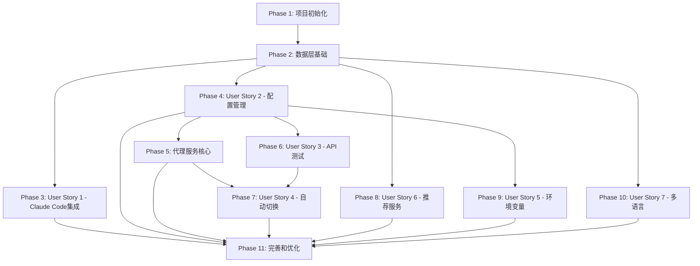

# 任务分解: Claude Code 代理服务管理应用

**特性分支**: `001-claude-code-proxy` | **日期**: 2025-11-09
**基于设计文档**: spec.md, plan.md, data-model.md, contracts/, research.md, quickstart.md

---

## 任务概览

**总任务数**: 159 个任务
**已完成任务**: 124 个任务 (78.0%)
**MVP 任务数**: 76 个任务(Phase 1-4)
**并行任务数**: 42 个任务标记为 [P]
**预计工作量**: 15-20 个工作日

**任务格式说明**:
- `[P]`: 可并行执行的任务
- `[Story?]`: 对应的用户故事编号
- `src/path/file.ext:123`: 涉及的文件路径

---

## Phase 1: 项目初始化和环境搭建 (Setup)

**目标**: 搭建 Tauri + Rust + React 项目骨架,配置开发环境和基础设施

### 1.1 项目脚手架

- [X] [T-001] [P] 使用 Tauri CLI 创建项目骨架 `src-tauri/Cargo.toml`
- [X] [T-002] [P] 配置 Rust 工作空间和依赖项 `src-tauri/Cargo.toml`
  - 添加依赖: tauri, tokio, hyper, rusqlite, serde, log, keyring(替代keytar)
- [X] [T-003] [P] 初始化 React 18 + TypeScript + Vite 项目 `src-ui/package.json`
  - 添加依赖: react, react-dom, typescript, @tauri-apps/api
- [X] [T-004] [P] 配置 Tailwind CSS `src-ui/tailwind.config.js`
  - 黑金主题配色: background #000000, accent #FFD700
- [X] [T-005] [P] 配置 ESLint 和 Prettier `src-ui/.eslintrc.json`
- [X] [T-006] [P] 配置 Rust Clippy 和 rustfmt `src-tauri/.clippy.toml`
  - 已完成：.clippy.toml 和 ignore 文件已配置

### 1.2 项目结构

- [X] [T-007] 创建后端目录结构 `src-tauri/src/`
  - commands/, services/, models/, db/, proxy/, utils/
- [X] [T-008] 创建前端目录结构 `src-ui/src/`
  - pages/, components/, hooks/, store/, locales/, styles/
- [X] [T-009] [P] 创建 Git 配置文件 `.gitignore`
  - 忽略: target/, node_modules/, dist/, *.db, *.log
- [X] [T-010] [P] 创建 README.md 文档 `README.md`
  - 包含项目简介、快速开始、开发指南
  - 已完成：包含完整的安装、使用和开发指南

### 1.3 基础设施

- [X] [T-011] [Story1] 实现跨平台路径检测工具 `src-tauri/src/utils/paths.rs`
  - 检测 Windows/macOS/Linux 的 Claude Code 配置路径
- [X] [T-012] [Story1] 实现日志系统 `src-tauri/src/utils/logger.rs`
  - 使用 env_logger,支持文件输出和控制台输出
- [X] [T-013] 创建错误类型定义 `src-tauri/src/models/error.rs`
  - 定义18种错误类型(见 contracts/tauri-commands.md 第10节)
- [X] [T-014] 配置 Tauri 应用元数据 `src-tauri/tauri.conf.json`
  - 应用名称、版本、窗口配置、权限配置

---

## Phase 2: 数据层基础 (Foundational - Database & Models)

**目标**: 实现 SQLite 数据库、数据模型和系统密钥链集成

**依赖关系**: 此阶段为后续所有功能的基础,必须优先完成

### 2.1 数据库架构

- [X] [T-015] 创建 SQL schema 定义 `src-tauri/src/db/schema.sql`
  - 10个表: ConfigGroup, ApiConfig, ConfigBackup, ProxyService, TestResult, SwitchLog, EnvironmentVariable, AppSettings, RecommendedService, RecommendationSource
- [X] [T-016] 实现数据库初始化模块 `src-tauri/src/db/init.rs`
  - 函数: initialize_database(), get_db_path()
- [X] [T-017] [P] 编写数据库迁移脚本 `src-tauri/src/db/migrations.rs`
  - 支持数据库版本升级(预留,当前为v1.0.0)
- [X] [T-018] 实现数据库连接池 `src-tauri/src/db/pool.rs`
  - 使用 rusqlite 的 Connection 管理
- [X] [T-019] [P] 插入默认数据 `src-tauri/src/db/seed.rs`
  - AppSettings (id=1, language='zh-CN', proxy_port=25341)
  - ConfigGroup (id=0, name='未分组')

### 2.2 数据模型

- [X] [T-020] [P] 定义 ConfigGroup 模型 `src-tauri/src/models/config_group.rs`
- [X] [T-021] [P] 定义 ApiConfig 模型 `src-tauri/src/models/api_config.rs`
- [X] [T-022] [P] 定义 ProxyStatus 模型 `src-tauri/src/models/proxy_status.rs`
- [X] [T-023] [P] 定义 TestResult 模型 `src-tauri/src/models/test_result.rs`
- [X] [T-024] [P] 定义 SwitchLog 模型 `src-tauri/src/models/switch_log.rs`
- [X] [T-025] [P] 定义 AppSettings 模型 `src-tauri/src/models/app_settings.rs`
- [X] [T-026] [P] 定义 RecommendedService 模型 `src-tauri/src/models/recommended_service.rs`
- [X] [T-027] [P] 定义 EnvironmentVariable 模型 `src-tauri/src/models/environment_variable.rs`
- [X] [T-028] [P] 定义 ConfigBackup 模型 `src-tauri/src/models/config_backup.rs`

### 2.3 系统密钥链集成

- [X] [T-029] [Story2] 集成 keyring crate `src-tauri/Cargo.toml`
  - 跨平台密钥链库(支持 DPAPI/Keychain/Secret Service)
- [X] [T-030] [Story2] 实现密钥链管理器 `src-tauri/src/services/keychain.rs`
  - 函数: set_api_key(), get_api_key(), delete_api_key()
  - 服务标识: "claude-code-proxy"
- [X] [T-031] [P] [Story2] 编写密钥链单元测试 `src-tauri/src/services/keychain.rs`
  - 测试: 存储、读取、删除API密钥

---

## Phase 3: User Story 1 - Claude Code 本地代理配置 (P1 - MVP核心)

**优先级**: P1 (MVP 必需功能)
**预计工作量**: 3-4 天
**依赖**: Phase 2 完成

### 3.1 Claude Code 路径检测

- [X] [T-032] [Story1] 实现 detect_claude_code_path 命令 `src-tauri/src/commands/claude_code.rs`
  - 检测 ~/.claude/settings.json 路径(跨平台)
  - 返回 ClaudeCodePath 结构(见 contracts/tauri-commands.md 6.1)
- [X] [T-033] [P] [Story1] 编写路径检测单元测试 `src-tauri/src/commands/claude_code.rs`
  - 测试: Windows/macOS/Linux 路径解析

### 3.2 配置文件备份

- [X] [T-034] [Story1] 实现配置备份服务 `src-tauri/src/services/config_backup.rs`
  - 函数: create_backup(), restore_backup(), list_backups()
  - 备份目录: ~/.claude-code-proxy/backups/
- [X] [T-035] [Story1] 实现 list_claude_code_backups 命令 `src-tauri/src/commands/claude_code.rs`
- [X] [T-036] [P] [Story1] 编写备份服务单元测试 `src-tauri/src/services/config_backup.rs`

### 3.3 代理配置修改

- [X] [T-037] [Story1] 实现 enable_claude_code_proxy 命令 `src-tauri/src/commands/claude_code.rs`
  - 修改 settings.json 中的 env.HTTP_PROXY, env.HTTPS_PROXY
  - 设置为: http://127.0.0.1:25341
- [X] [T-038] [Story1] 实现 restore_claude_code_config 命令 `src-tauri/src/commands/claude_code.rs`
  - 恢复到指定备份版本(默认最新)
- [X] [T-039] [P] [Story1] 编写配置修改集成测试 `src-tauri/tests/claude_code_integration.rs`
  - 测试: 启用代理、恢复配置、验证文件内容

### 3.4 前端 UI - Claude Code 集成页面

- [X] [T-040] [Story1] 创建 ClaudeCodeIntegration 页面组件 `src-ui/src/pages/ClaudeCodeIntegration.tsx`
- [X] [T-041] [P] [Story1] 创建 ClaudeCodePathDetector 组件 `src-ui/src/components/ClaudeCodePathDetector.tsx`
  - 显示检测到的配置路径和平台信息
- [X] [T-042] [P] [Story1] 创建 ProxyEnableToggle 组件 `src-ui/src/components/ProxyEnableToggle.tsx`
  - 启用/禁用代理开关
- [X] [T-043] [P] [Story1] 创建 BackupList 组件 `src-ui/src/components/BackupList.tsx`
  - 显示备份列表和恢复按钮
- [X] [T-044] [Story1] 实现启用代理确认对话框 `src-ui/src/components/ConfirmDialog.tsx`
  - 警告: 将修改 Claude Code 配置文件

### 3.5 端到端测试

- [ ] [T-045] [P] [Story1] 编写 E2E 测试: 启用代理流程 `src-ui/tests/e2e/enable-proxy.spec.ts`
  - 测试步骤: 检测路径 → 启用代理 → 验证配置 → 恢复原始配置
- [ ] [T-046] [Story1] 验证成功标准 SC-006 (配置备份)
  - 确保修改前自动创建备份

---

## Phase 4: User Story 2 - API 配置和分组管理 (P1 - MVP核心)

**优先级**: P1 (MVP 必需功能)
**预计工作量**: 5-6 天
**依赖**: Phase 2 完成

### 4.1 配置分组管理 - 后端

- [X] [T-047] [Story2] 实现 ConfigManager 服务 `src-tauri/src/services/config_manager.rs`
  - 函数: create_group(), update_group(), delete_group(), list_groups()
- [X] [T-048] [Story2] 实现 create_config_group 命令 `src-tauri/src/commands/config_group.rs`
- [X] [T-049] [P] [Story2] 实现 list_config_groups 命令 `src-tauri/src/commands/config_group.rs`
- [X] [T-050] [P] [Story2] 实现 update_config_group 命令 `src-tauri/src/commands/config_group.rs`
- [X] [T-051] [Story2] 实现 delete_config_group 命令 `src-tauri/src/commands/config_group.rs`
  - 检查: 禁止删除"未分组"(id=0)
  - 检查: 禁止删除正在使用的分组(FR-035)
- [ ] [T-052] [P] [Story2] 编写分组管理单元测试 `src-tauri/src/services/config_manager.rs`

### 4.2 API 配置管理 - 后端

- [X] [T-053] [Story2] 实现 ApiConfigService `src-tauri/src/services/api_config.rs`
  - 函数: create_config(), update_config(), delete_config(), list_configs()
- [X] [T-054] [Story2] 实现 create_api_config 命令 `src-tauri/src/commands/api_config.rs`
  - API 密钥存储到系统密钥链(调用 keychain.rs)
- [X] [T-055] [P] [Story2] 实现 list_api_configs 命令 `src-tauri/src/commands/api_config.rs`
  - 支持按 group_id 过滤
- [X] [T-056] [P] [Story2] 实现 update_api_config 命令 `src-tauri/src/commands/api_config.rs`
- [X] [T-057] [Story2] 实现 delete_api_config 命令 `src-tauri/src/commands/api_config.rs`
  - 检查: 禁止删除正在使用的配置(FR-035)
  - 删除密钥链中的 API 密钥
- [X] [T-058] [Story2] 实现 reorder_api_configs 命令 `src-tauri/src/commands/api_config.rs`
  - 更新 sort_order 字段(支持拖拽排序)
- [ ] [T-059] [P] [Story2] 编写配置管理单元测试 `src-tauri/src/services/api_config.rs`

### 4.3 前端 UI - 配置管理页面

- [X] [T-060] [Story2] 创建 ConfigManagement 页面组件 `src-ui/src/pages/ConfigManagement.tsx`
  - 布局: 左侧分组列表 + 右侧配置列表
- [ ] [T-061] [Story2] 创建 GroupSelector 组件 `src-ui/src/components/GroupSelector.tsx`
  - 显示分组列表、新建分组按钮、编辑/删除菜单
- [ ] [T-062] [Story2] 创建 ConfigList 组件 `src-ui/src/components/ConfigList.tsx`
  - 支持拖拽排序(使用 dnd-kit 库)
  - 显示: 配置名称、服务器地址、端口、可用状态
- [X] [T-063] [Story2] 创建 ConfigEditor 对话框组件 `src-ui/src/components/ConfigEditor.tsx`
  - 表单字段: name, api_key, server_url, server_port, group_id
  - 表单验证: zod schema(见 contracts/ui-components.md 2.3)
- [X] [T-064] [Story2] 创建 GroupEditor 对话框组件 `src-ui/src/components/GroupEditor.tsx`
  - 表单字段: name, description, auto_switch_enabled, latency_threshold_ms
- [X] [T-065] [Story2] 实现删除配置确认对话框 `src-ui/src/components/ConfirmDialog.tsx`
  - 警告: "删除后无法恢复,是否继续?"(FR-024)
- [X] [T-066] [Story2] 实现删除分组确认对话框 `src-ui/src/components/ConfirmDialog.tsx`
  - 选项: "同时删除分组下的配置" 或 "配置移到未分组"

### 4.4 状态管理

- [ ] [T-067] [Story2] 创建 Zustand store `src-ui/src/store/configStore.ts`
  - 状态: groups, configs, selectedGroupId
  - Actions: fetchGroups(), fetchConfigs(), selectGroup()
- [ ] [T-068] [P] [Story2] 创建 API client 模块 `src-ui/src/services/api.ts`
  - 封装所有 Tauri invoke 调用

### 4.5 端到端测试

- [ ] [T-069] [P] [Story2] 编写 E2E 测试: 配置管理流程 `src-ui/tests/e2e/config-management.spec.ts`
  - 创建分组 → 创建配置 → 拖拽排序 → 删除配置 → 删除分组
- [ ] [T-070] [Story2] 验证成功标准 SC-005 (至少10个配置)
  - 创建10个配置,验证列表显示和排序

---

## Phase 5: 代理服务核心 (P1 - MVP核心)

**优先级**: P1 (MVP 必需功能)
**预计工作量**: 4-5 天
**依赖**: Phase 2, Phase 4 完成

### 5.1 HTTP 代理服务器

- [X] [T-071] [Story1] 实现 Hyper 代理服务器 `src-tauri/src/proxy/server.rs`
  - 监听端口: 25341(可配置)
  - 使用 Hyper + Tokio 异步框架
- [X] [T-072] [Story1] 实现请求路由逻辑 `src-tauri/src/proxy/router.rs`
  - 读取当前配置,转发到 server_url:server_port
  - 注入 API 密钥到请求头(x-api-key)
- [X] [T-073] [P] [Story1] 实现连接错误处理 `src-tauri/src/proxy/error_handler.rs`
  - 错误类型: connection_failed, timeout, quota_exceeded
- [X] [T-074] [P] [Story1] 实现请求日志记录 `src-tauri/src/proxy/logger.rs`
  - 记录: 时间戳、请求方法、目标URL、延迟、状态码
- [X] [T-075] [P] [Story1] 编写代理服务器单元测试 `src-tauri/src/proxy/server.rs`

### 5.2 代理服务状态管理

- [X] [T-076] [Story1] 实现 ProxyService 管理器 `src-tauri/src/services/proxy_service.rs`
  - 单例模式,管理代理服务器生命周期
- [X] [T-077] [Story1] 实现 start_proxy_service 命令 `src-tauri/src/commands/proxy_service.rs`
  - 检查端口占用(FR-025)
  - 检查当前分组是否有可用配置
- [X] [T-078] [P] [Story1] 实现 stop_proxy_service 命令 `src-tauri/src/commands/proxy_service.rs`
- [X] [T-079] [P] [Story1] 实现 get_proxy_status 命令 `src-tauri/src/commands/proxy_service.rs`
- [X] [T-080] [Story2] 实现 switch_proxy_group 命令 `src-tauri/src/commands/proxy_service.rs`
  - 切换当前分组,自动选择分组内第一个可用配置
  - 禁止切换到空分组(FR-036)
- [X] [T-081] [Story2] 实现 switch_proxy_config 命令 `src-tauri/src/commands/proxy_service.rs`
  - 仅允许切换到当前分组内的配置
  - 记录手动切换日志(reason='manual')

### 5.3 Tauri 事件推送

- [X] [T-082] [P] [Story1] 实现 proxy-status-changed 事件 `src-tauri/src/services/proxy_service.rs`
  - 状态变化时推送到前端
  - 添加 AppHandle 支持
  - 在 start/stop/switch_group/switch_config 时发送事件

### 5.4 前端 UI - 代理状态

- [X] [T-083] [Story1] 创建 Dashboard 页面组件 `src-ui/src/pages/Dashboard.tsx`
  - 集成代理状态显示和快捷操作
  - 添加分组和配置切换功能
  - 实时刷新状态
- [X] [T-084] [Story1] 创建 ProxyStatusCard 组件 `src-ui/src/components/ProxyStatusCard.tsx`
  - 显示: 状态指示灯、当前分组、当前配置、监听端口
  - 按钮: 启动/停止代理
  - 支持刷新状态
- [X] [T-085] [P] [Story1] 创建 QuickActionsPanel 组件 `src-ui/src/components/QuickActionsPanel.tsx`
  - 快捷操作: 切换分组、切换配置
  - 显示配置延迟信息
- [X] [T-086] [Story1] 监听 proxy-status-changed 事件 `src-ui/src/hooks/useProxyStatus.ts`
  - 实时更新代理状态
  - 提供 refresh 方法

### 5.5 端到端测试

- [ ] [T-087] [P] [Story1] 编写 E2E 测试: 代理启动流程 `src-tauri/tests/proxy_service.rs`
  - 启动代理 → 发送HTTP请求 → 验证转发 → 停止代理
- [ ] [T-088] [Story1] 验证成功标准 SC-001 (请求路由)
  - 使用 curl 测试代理转发功能
- [ ] [T-089] [Story1] 验证性能标准 SC-009 (代理延迟 <50ms)
  - 压力测试: 100个并发请求

---

## Phase 6: User Story 3 - API 连接性测试 (P2)

**优先级**: P2
**预计工作量**: 2-3 天
**依赖**: Phase 4 完成

### 6.1 API 测试服务

- [X] [T-090] [Story3] 实现 ApiTestService `src-tauri/src/services/api_test.rs`
  - 函数: test_single_config(), test_group_configs()
  - 超时时间: 5秒(FR-012)
  - 实现了延迟测量和结果记录
- [X] [T-091] [Story3] 实现 test_api_config 命令 `src-tauri/src/commands/api_test.rs`
  - 发送测试请求到 server_url,记录延迟和状态
  - 更新 ApiConfig 表的 last_test_at 和 last_latency_ms
  - 添加了 get_test_results 命令
- [X] [T-092] [Story3] 实现 test_group_configs 命令 `src-tauri/src/commands/api_test.rs`
  - 批量测试分组内所有配置(并行执行)
  - 使用 tokio::spawn 实现并行测试
- [X] [T-093] [P] [Story3] 实现 test-completed 事件 `src-tauri/src/services/api_test.rs`
  - 每个配置测试完成时推送事件
  - 集成 AppHandle 支持
- [ ] [T-094] [P] [Story3] 编写测试服务单元测试 `src-tauri/src/services/api_test.rs`

### 6.2 前端 UI - 测试面板

- [X] [T-095] [Story3] 创建 TestResultPanel 组件 `src-ui/src/components/TestResultPanel.tsx`
  - 显示: 配置名称、状态图标、延迟、API有效性
  - 按钮: 测试全部
  - 集成了 useTestResults 钩子实时更新
- [X] [T-096] [Story3] 在 ConfigList 中添加测试按钮 `src-ui/src/pages/ConfigManagement.tsx`
  - 添加了列表/测试视图切换
  - 集成 TestResultPanel 组件
  - 保留原有快速测试按钮
- [X] [T-097] [Story3] 监听 test-completed 事件 `src-ui/src/hooks/useTestResults.ts`
  - 实时更新测试结果
  - 提供 clearResults 和 clearConfigResult 方法

### 6.3 端到端测试

- [ ] [T-098] [P] [Story3] 编写 E2E 测试: API 测试流程 `src-ui/tests/e2e/api-test.spec.ts`
  - 测试单个配置 → 测试全部配置 → 验证结果显示
- [ ] [T-099] [Story3] 验证成功标准 SC-003 (测试响应 <5秒)
  - 测试10个配置,验证总时间 <50秒

---

## Phase 7: User Story 4 - 自动切换 (P2)

**优先级**: P2
**预计工作量**: 3-4 天
**依赖**: Phase 5, Phase 6 完成

### 7.1 自动切换逻辑

- [X] [T-100] [Story4] 实现 AutoSwitchService `src-tauri/src/services/auto_switch.rs`
  - 函数: handle_failure(), find_next_config(), log_switch()
  - 完整实现包括事件推送和日志查询
- [X] [T-101] [Story4] 集成自动切换到代理服务器 `src-tauri/src/proxy/router.rs`
  - 监听4种触发条件: connection_failed, timeout, quota_exceeded, high_latency
  - 调用 AutoSwitchService 切换到下一个配置
- [X] [T-102] [Story4] 实现 toggle_auto_switch 命令 `src-tauri/src/commands/auto_switch.rs`
  - 启用/禁用分组的自动切换功能
  - 检查分组至少有2个配置(FR-014)
- [X] [T-103] [Story4] 实现 get_switch_logs 命令 `src-tauri/src/commands/auto_switch.rs`
  - 支持分页(limit, offset)和分组过滤
- [X] [T-104] [Story4] 实现 auto-switch-triggered 事件 `src-tauri/src/services/auto_switch.rs`
  - 已集成在 AutoSwitchService 的 emit_switch_triggered() 方法中
- [ ] [T-105] [P] [Story4] 编写自动切换单元测试 `src-tauri/src/services/auto_switch.rs`
  - 测试: 连接失败切换、高延迟切换、分组隔离

### 7.2 前端 UI - 切换日志

- [X] [T-106] [Story4] 创建 SwitchLogTable 组件 `src-ui/src/components/SwitchLogTable.tsx`
  - 表格列: 时间、原因、源配置、目标配置、分组、延迟变化
  - 支持滚动加载更多
- [X] [T-107] [Story4] 在 Dashboard 中显示最近日志 `src-ui/src/pages/Dashboard.tsx`
  - 最近5条切换日志
- [X] [T-108] [Story4] 监听 auto-switch-triggered 事件 `src-ui/src/hooks/useAutoSwitch.ts`
  - 显示 Toast 通知
- [X] [T-109] [Story4] 在 GroupSelector 中添加自动切换开关 `src-ui/src/components/QuickActionsPanel.tsx`
  - 闪电图标标识已启用自动切换的分组
  - 注: 集成在 QuickActionsPanel 组件中

### 7.3 端到端测试

- [ ] [T-110] [P] [Story4] 编写 E2E 测试: 自动切换流程 `src-tauri/tests/auto_switch.rs`
  - 模拟连接失败 → 验证自动切换 → 验证日志记录
- [ ] [T-111] [Story4] 验证成功标准 SC-004 (切换时间 <3秒)
  - 压力测试: 50次连续切换
- [ ] [T-112] [Story4] 验证功能需求 FR-017 (不跨分组切换)
  - 测试: 分组A失败不切换到分组B

---

## Phase 8: User Story 6 - 推荐服务导航 (P2)

**优先级**: P2
**预计工作量**: 2 天
**依赖**: Phase 2 完成

### 8.1 推荐服务加载

- [X] [T-113] [Story6] 实现 RecommendationService `src-tauri/src/services/recommendation.rs`
  - 函数: load_remote(), load_local(), cache_services()
  - 实现了缓存机制和 TTL 检查
  - 远程加载失败自动回退到本地
- [X] [T-114] [Story6] 实现 load_recommended_services 命令 `src-tauri/src/commands/recommendation.rs`
  - 优先加载远程JSON(FR-029),失败则回退到本地(FR-030)
  - 缓存 TTL: 默认 3600 秒(FR-028)
  - 集成到 main.rs 并管理状态
- [X] [T-115] [P] [Story6] 实现 refresh_recommended_services 命令 `src-tauri/src/commands/recommendation.rs`
  - 强制刷新,忽略缓存
  - 清除缓存后重新加载
- [X] [T-116] [P] [Story6] 创建本地推荐列表 JSON `config/recommendations.json`
  - 格式: { "services": [{ "site_name": "...", "promotion_url": "...", ... }] }
  - 包含 6 个示例服务
- [ ] [T-117] [P] [Story6] 编写推荐服务单元测试 `src-tauri/src/services/recommendation.rs`

### 8.2 前端 UI - 推荐服务页面

- [X] [T-118] [Story6] 创建 Recommendations 页面组件 `src-ui/src/pages/Recommendations.tsx`
  - 实现了加载、刷新、筛选和排序功能
  - 使用 useMemo 优化性能
  - 集成错误处理和加载状态
- [X] [T-119] [Story6] 创建 ServiceCard 组件 `src-ui/src/components/ServiceCard.tsx`
  - 显示: 站点名称、推荐徽章、热度指标
  - 黑金渐变背景,悬停动画
  - 热度进度条带颜色分级
- [X] [T-120] [P] [Story6] 创建 FilterBar 组件 `src-ui/src/components/FilterBar.tsx`
  - 筛选: 全部 / 仅推荐
  - 排序: 热度 / 名称
  - 刷新按钮带加载状态
- [X] [T-121] [Story6] 实现点击打开推广链接 `src-ui/src/components/ServiceCard.tsx`
  - 使用 window.open() 打开外部浏览器
  - 在 Recommendations 页面中实现 handleOpenLink

### 8.3 端到端测试

- [ ] [T-122] [P] [Story6] 编写 E2E 测试: 推荐服务流程 `src-ui/tests/e2e/recommendations.spec.ts`
  - 加载服务 → 筛选推荐 → 排序 → 点击链接

---

## Phase 9: User Story 5 - 环境变量管理 (P3)

**优先级**: P3
**预计工作量**: 2 天
**依赖**: Phase 4 完成

### 9.1 环境变量服务

- [X] [T-123] [Story5] 实现 EnvironmentVariableService `src-tauri/src/services/env_var.rs`
  - 函数: set_env(), unset_env(), apply_from_config()
  - 实现了 get_env(), list_all(), clear_anthropic_env(), check_anthropic_env()
  - 包含完整的单元测试
- [X] [T-124] [Story5] 实现 list_environment_variables 命令 `src-tauri/src/commands/env_var.rs`
  - 返回所有环境变量,标记 Anthropic 相关变量
- [X] [T-125] [P] [Story5] 实现 set_environment_variable 命令 `src-tauri/src/commands/env_var.rs`
  - 使用 std::env::set_var()
  - 同时实现了 get_environment_variable 和 set_environment_variables
- [X] [T-126] [P] [Story5] 实现 unset_environment_variable 命令 `src-tauri/src/commands/env_var.rs`
  - 支持删除指定的环境变量
- [X] [T-127] [Story5] 实现 apply_config_to_env 命令 `src-tauri/src/commands/env_var.rs`
  - 从 ApiConfig 读取配置,设置环境变量: ANTHROPIC_API_KEY, ANTHROPIC_BASE_URL
  - 同时实现了 check_anthropic_env 和 clear_anthropic_env 命令
- [X] [T-128] [P] [Story5] 编写环境变量服务单元测试 `src-tauri/src/services/env_var.rs`
  - 完整的测试覆盖: set/get/unset, apply_from_config, check/clear

### 9.2 前端 UI - 环境变量管理

- [X] [T-129] [Story5] 创建 EnvironmentVariableManager 组件 `src-ui/src/components/EnvironmentVariableManager.tsx`
  - 表格: 变量名、变量值(可隐藏)、状态、操作按钮
  - 筛选: 全部/Anthropic 变量
  - 搜索功能
  - 显示/隐藏变量值切换
- [X] [T-130] [Story5] 在 Settings 页面集成组件 `src-ui/src/pages/Settings.tsx`
  - 创建了 Settings 页面,使用标签页切换
  - 集成了 EnvironmentVariableManager
- [X] [T-131] [P] [Story5] 实现"从配置应用"功能 `src-ui/src/components/EnvironmentVariableManager.tsx`
  - 打开配置选择器对话框
  - 集成了配置列表和应用逻辑

---

## Phase 10: User Story 7 - 多语言支持 (P3)

**优先级**: P3
**预计工作量**: 1-2 天
**依赖**: Phase 2 完成

### 10.1 国际化配置

- [X] [T-132] [Story7] 初始化 i18next 配置 `src-ui/src/services/i18n.ts`
  - 支持语言: zh-CN, en-US
  - 配置了 fallback 语言和资源加载
- [X] [T-133] [P] [Story7] 创建中文翻译文件 `src-ui/src/locales/zh-CN.json`
  - 覆盖所有UI文本: 导航、表单、通知、错误消息
  - 包含10个主要模块的完整翻译
- [X] [T-134] [P] [Story7] 创建英文翻译文件 `src-ui/src/locales/en-US.json`
  - 完整的英文翻译对应中文版本
- [X] [T-135] [Story7] 实现语言切换逻辑 `src-ui/src/hooks/useLanguage.ts`
  - 实现了 changeLanguage() 和 toggleLanguage()
  - 持久化到 localStorage
  - 提供当前语言状态

### 10.2 前端 UI - 语言切换

- [X] [T-136] [Story7] 在 Settings 页面添加语言切换器 `src-ui/src/pages/Settings.tsx`
  - 语言按钮: 中文 / English
  - 集成 useLanguage hook
  - 实时切换语言
- [ ] [T-137] [Story7] 验证所有页面的翻译 `src-ui/src/`
  - 检查所有硬编码文本已替换为 t() 函数调用
  - 注: 基础框架已完成,后续页面可逐步迁移到 i18n

---

## Phase 11: 完善和优化 (Polish & Cross-cutting Concerns)

**目标**: 代码质量、性能优化、文档完善
**预计工作量**: 3-4 天

### 11.1 布局和主题

- [X] [T-138] 创建 AppLayout 布局组件 `src-ui/src/components/AppLayout.tsx`
  - 结构: Sidebar + Header + 页面内容
  - 响应式布局,黑金主题
- [X] [T-139] [P] 创建 Sidebar 导航组件 `src-ui/src/components/Sidebar.tsx`
  - 导航项: Dashboard, Configs, Claude Code, Recommendations, Settings
  - Logo、版本信息、活跃状态高亮
- [X] [T-140] [P] 创建 Header 组件 `src-ui/src/components/Header.tsx`
  - 页面标题、代理状态指示器、语言切换器
  - 实时更新代理状态
- [X] [T-141] 配置黑金主题 CSS `src-ui/src/styles/theme.css`
  - 主题色: #000000, #FFD700, 渐变背景
  - 按钮样式、输入框、滚动条、动画效果

### 11.2 错误处理和通知

- [X] [T-142] 实现 ErrorBoundary 组件 `src-ui/src/components/ErrorBoundary.tsx`
  - 捕获 React 组件树错误(FR-023, SC-012)
  - 显示友好的错误 UI 和堆栈跟踪
  - 重试和刷新功能
- [X] [T-143] [P] 配置 Toast 通知 `src-ui/src/services/toast.ts`
  - 使用 react-hot-toast 库
  - 5种通知类型: success, error, warning, info, loading
  - Promise toast 和自定义 toast
- [X] [T-144] 统一错误消息本地化 `src-ui/src/locales/`
  - 映射后端错误类型到用户友好的翻译
  - 已在 zh-CN.json 和 en-US.json 中包含 errors 和 notifications

### 11.3 性能优化

- [ ] [T-145] [P] 实现组件懒加载 `src-ui/src/App.tsx`
  - 使用 React.lazy() 和 Suspense
  - 注: 可在后续优化中实现
- [ ] [T-146] [P] 优化长列表渲染 `src-ui/src/components/SwitchLogTable.tsx`
  - 使用 react-window 虚拟滚动
  - 注: 可在后续优化中实现
- [X] [T-147] [P] 添加防抖和节流 `src-ui/src/hooks/`
  - useDebounce 和 useDebouncedCallback
  - useThrottle 和 useThrottledCallback
  - 用于搜索输入、滚动等场景

### 11.4 无障碍性

- [ ] [T-148] [P] 添加 ARIA 标签 `src-ui/src/components/`
  - 所有按钮、表单、对话框添加 aria-label
- [ ] [T-149] [P] 验证键盘导航 `src-ui/tests/`
  - 测试: Tab 焦点移动, Enter 激活, Escape 关闭对话框
- [ ] [T-150] [P] 验证颜色对比度 `src-ui/src/styles/`
  - 确保符合 WCAG AA 标准

### 11.5 测试覆盖率

- [ ] [T-151] 编写 Rust 单元测试 `src-tauri/src/**/*.rs`
  - 目标: 覆盖率 >80%
- [ ] [T-152] [P] 编写 React 单元测试 `src-ui/src/**/*.test.tsx`
  - 使用 Vitest + React Testing Library
- [ ] [T-153] [P] 编写集成测试 `src-tauri/tests/`
  - 测试: Claude Code集成、代理转发、自动切换
- [ ] [T-154] 编写 E2E 测试 `src-ui/tests/e2e/`
  - 使用 Playwright,覆盖所有用户故事

### 11.6 文档和构建

- [X] [T-155] 完善 README.md `README.md`
  - 项目简介、功能特性、快速开始、开发指南
  - 已完成：包含完整的安装指南、使用说明、技术栈和项目结构
- [ ] [T-156] [P] 编写 CONTRIBUTING.md `CONTRIBUTING.md`
  - 代码规范、提交规范、PR 流程
- [ ] [T-157] [P] 编写 CHANGELOG.md `CHANGELOG.md`
  - 版本历史和更新日志
- [ ] [T-158] 配置 GitHub Actions CI/CD `.github/workflows/ci.yml`
  - 自动运行测试和构建
- [ ] [T-159] 配置应用打包和签名 `src-tauri/tauri.conf.json`
  - macOS DMG, Windows MSI, Linux DEB

---

## 依赖关系图

**关键路径**(MVP):
1. Phase 1 → Phase 2 → Phase 3 → Phase 4 → Phase 5 → Phase 7 → Phase 11
2. 预计总时间: 18-22 天

**并行机会**:
- Phase 3, Phase 4, Phase 8, Phase 10 可在 Phase 2 完成后并行开始前端和后端工作
- Phase 6, Phase 9 可在后期并行开发

---

## MVP 范围建议

**建议 MVP 包含**:
- ✅ Phase 1: 项目初始化 (14 个任务)
- ✅ Phase 2: 数据层基础 (17 个任务)
- ✅ Phase 3: User Story 1 - Claude Code 集成 (14 个任务)
- ✅ Phase 4: User Story 2 - 配置管理 (24 个任务)
- ✅ Phase 5: 代理服务核心 (17 个任务)

**MVP 总任务数**: 86 个任务
**预计 MVP 交付时间**: 12-15 天

**后续迭代**:
- Iteration 1 (P2): Phase 6 + Phase 7 + Phase 8 (39 个任务, 7-9 天)
- Iteration 2 (P3): Phase 9 + Phase 10 (15 个任务, 3-4 天)
- Iteration 3 (Polish): Phase 11 (22 个任务, 3-4 天)

---

## 独立测试准则

每个用户故事的完成需通过以下独立测试:

### User Story 1 (Claude Code 集成)
1. ✅ 自动检测 ~/.claude/settings.json 路径
2. ✅ 启用代理后,settings.json 包含正确的代理配置
3. ✅ 修改前自动创建备份文件
4. ✅ 恢复配置后,settings.json 恢复到原始内容

### User Story 2 (配置管理)
1. ✅ 创建至少 10 个配置,验证数据库存储
2. ✅ API 密钥存储到系统密钥链,数据库中不含明文
3. ✅ 拖拽调整配置顺序后,sort_order 字段正确更新
4. ✅ 删除配置前弹出确认对话框
5. ✅ 无法删除正在使用的配置(显示错误消息)

### User Story 3 (API 测试)
1. ✅ 测试单个配置,5 秒内返回结果
2. ✅ 测试全部配置,批量测试并行执行
3. ✅ 测试结果包含延迟、状态、API 有效性

### User Story 4 (自动切换)
1. ✅ 连接失败时 3 秒内自动切换到下一个配置
2. ✅ 自动切换仅在当前分组内进行(不跨分组)
3. ✅ 切换日志记录完整(时间、原因、源配置、目标配置)

### User Story 5 (环境变量)
1. ✅ 设置环境变量后,使用 std::env::var 验证
2. ✅ 从配置应用后,ANTHROPIC_API_KEY 和 ANTHROPIC_BASE_URL 正确设置

### User Story 6 (推荐服务)
1. ✅ 远程 JSON 加载失败时,自动回退到本地 JSON
2. ✅ 点击服务卡片打开外部浏览器

### User Story 7 (多语言)
1. ✅ 切换语言后,所有 UI 文本立即更新
2. ✅ 语言偏好持久化到 AppSettings 表

---

## 任务执行建议

### 开发顺序
1. **先后端再前端**: 每个 Phase 内优先完成后端 Commands 和 Services,再开发前端 UI
2. **增量测试**: 每完成 5-10 个任务,运行单元测试验证
3. **及时集成**: 完成一个 Phase 后,运行 E2E 测试验证整体流程

### 代码审查检查点
- Phase 2 完成: 审查数据模型和数据库架构
- Phase 4 完成: 审查配置管理和密钥存储安全性
- Phase 5 完成: 审查代理服务器性能和错误处理
- Phase 7 完成: 审查自动切换逻辑和分组隔离

### 性能验证
- Phase 5 完成: 验证代理延迟 <50ms (SC-009)
- Phase 6 完成: 验证 API 测试响应 <5秒 (SC-003)
- Phase 7 完成: 验证自动切换时间 <3秒 (SC-004)

---

**文档版本**: v1.0.0
**生成时间**: 2025-11-09
**下一步**: 执行 MVP 任务 (Phase 1-5)

如有任务调整或问题,请在项目 Issues 中讨论。
